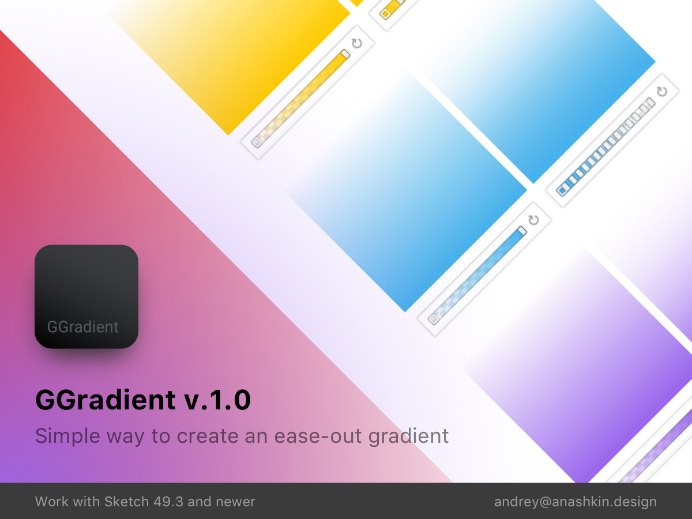

# GGradient

<a href="https://github.com/andex/ggradient/archive/master.zip">
  # Download GGradient Plugin
</a>

Double click the downloaded file (*GGradient.sketchplugin*) to install it.

## Hot key

Use CMD+SHIFT+G

**If you are using this plugin, please 'star' this project**. It's a simple way for me to be able to see how many people are using this, and how much effort I need to put into improving it further.

If you ***love*** this plugin, why not shout me a coffee ☕️ via [PayPal](https://paypal.me/andexds/3) to share the love!
It will definitely help me to be able to support this plugin further.

<a href="https://paypal.me/andexds/3">
  ☕️ Shout me a coffee
</a>
